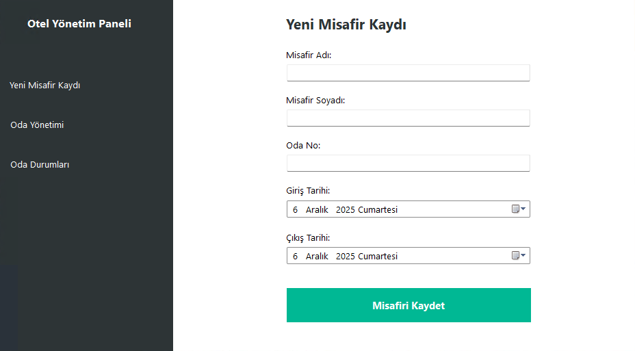
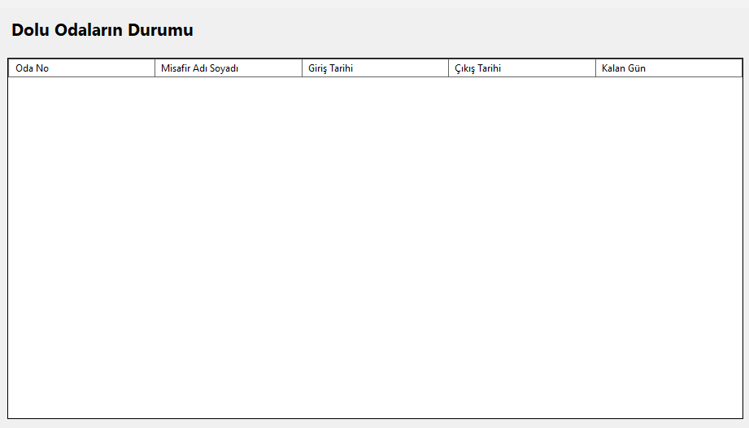
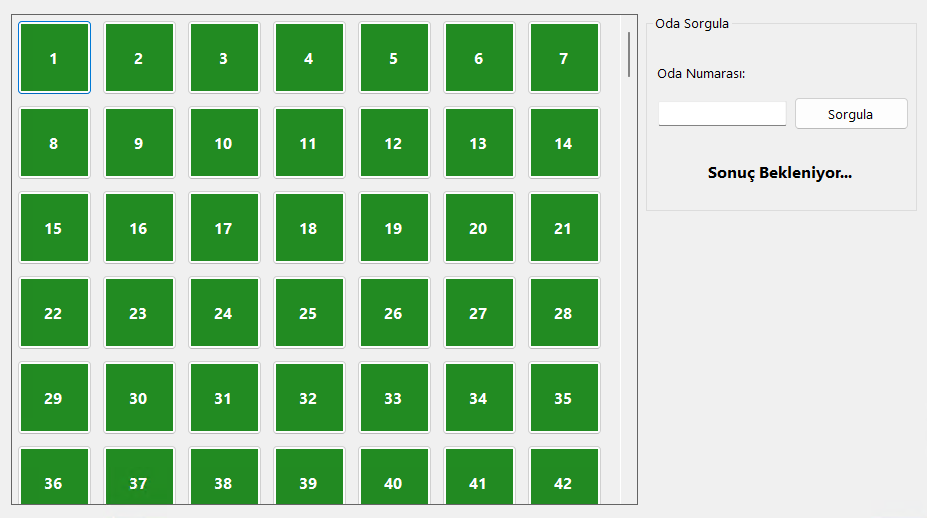

# 🏨 Otel Otomasyon Sistemi

C# ve Windows Forms kullanılarak geliştirilmiş, MySQL veritabanı altyapısına sahip kapsamlı bir otel yönetim paneli.

### 1. Giriş Ekranı ve Menü


### 2. Yeni Misafir Kaydı


### 3. Oda Yönetim Paneli


## 🚀 Özellikler

* **Misafir Kaydı:** Yeni misafirlerin adı, soyadı, giriş-çıkış tarihleri ile sisteme kaydedilmesi.
* **Oda Durum Kontrolü:** Oda numarası girildiğinde anlık olarak "Dolu/Boş" durumunun renkli uyarılarla gösterilmesi.
* **Dolu Odalar Listesi:** Otelde konaklayan misafirlerin ve oda bilgilerinin listelenmesi.
* **Kritik Uyarı Sistemi:** Çıkış tarihine 0 gün veya daha az kalan odaların otomatik olarak kırmızı renkle vurgulanması.
* **MySQL Veritabanı:** Tüm verilerin güvenli ve ilişkisel bir veritabanında tutulması.

## 🛠️ Kullanılan Teknolojiler

* **Dil:** C# (.NET 8.0)
* **Arayüz:** Windows Forms (WinForms)
* **Veritabanı:** MySQL
* **Kütüphaneler:** MySql.Data

## ⚙️ Kurulum ve Çalıştırma

Bu projeyi kendi bilgisayarınızda çalıştırmak için aşağıdaki adımları izleyin:

1.  Projeyi klonlayın:
    ```bash
    git clone https://github.com/Cihan0806/Otel-Sistemi.git
    ```
2.  Visual Studio 2022 ile `MainForm.sln` dosyasını açın.
3.  **ÖNEMLİ:** Güvenlik nedeniyle veritabanı şifresi koddan çıkarılmıştır. `Form1.cs` dosyasını açın ve `connectionString` satırına kendi MySQL şifrenizi girin:
    ```csharp
    string connectionString = "Server=IP_ADRESIN;Database=DATABASEADIN;Uid=MYSQLKULLANICIADI;Pwd=SENIN_SIFREN;";
    ```
4.  Projeyi derleyin ve başlatın!


---
*Geliştirici: Cihan Demir*
